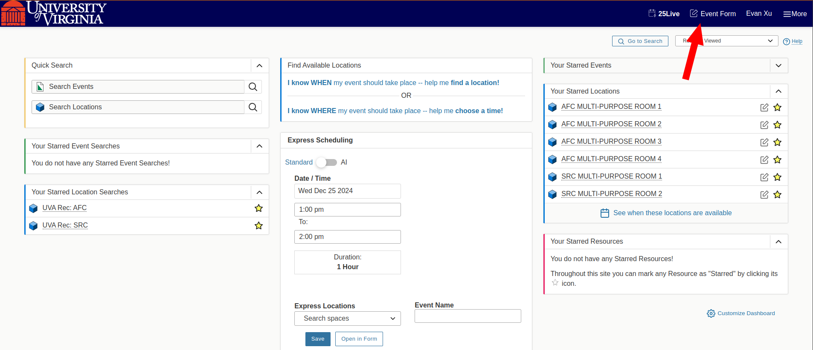
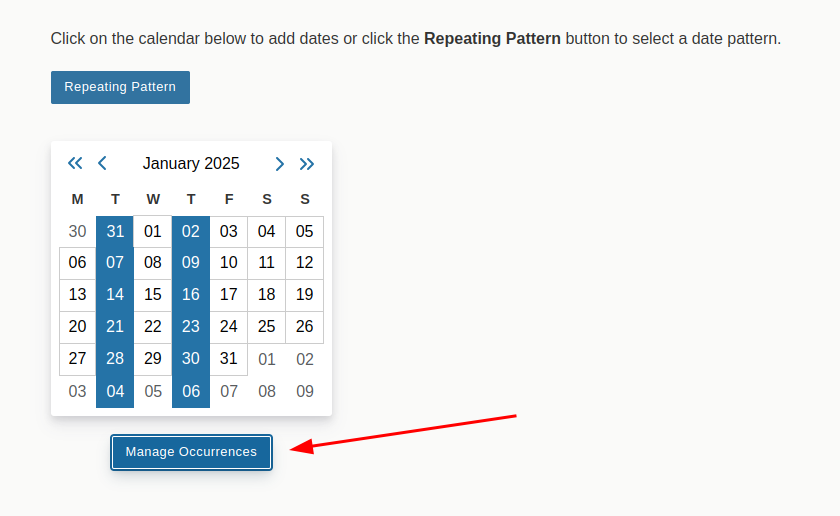
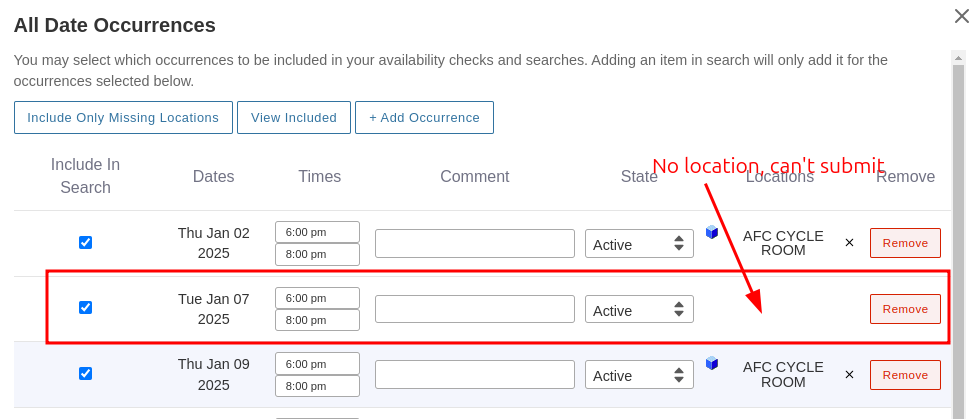
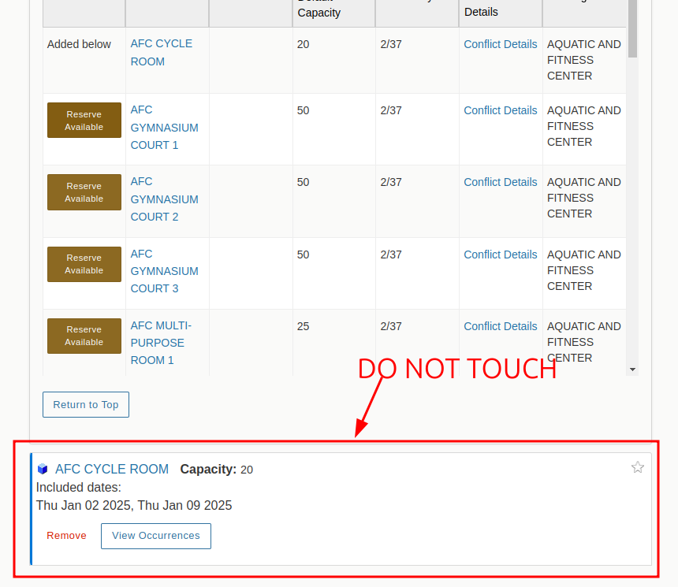

# 25live autofill

A small side project to fill out room reservations via robot ;)

Think of this script as greedy: it will reserve ALL possible available times in two rooms.
Whether that means 56 practices booked or 2 practices booked, it will look at the two rooms specified
and book all possible practices.

This means that if only one of the two rooms is available, it will book all possible practice times in there.
This also means if that both rooms are available at the practice time, it will book both rooms for that day.

# Installation

1. Make sure you have Nodejs installed so you can run Javascript on your command line.

You can check by running `node -v` to see if you have it.
If you don't have it installed, you can find it [here](https://nodejs.org/en/)

2. Next, you want to install pnpm globally. This project only works with pnpm as a package manager.

```bash
npm install -g pnpm
```

3. Pull this git repository onto your computer and run `pnpm install` in the root directory of this project to install the dependencies.

```bash
pnpm install
```

4. You want to find the chromeExecutable variable at the top of script.js and change it to where the Google Chrome executable is on your computer.

# Usage

There are some default settings in place at the top of script.js.
If you want to change any of them, you edit those straight in the file.

otherwise, make sure you are in the root of this project and go to the terminal and run:

```bash
node script.js
```

alternatively, you can run it with 2 command line arguments: this is useful if you found your original time didn't work by a few minutes, you can offset it.

```bash
node script.js 5:00 6:00
```

The script expects these two times to be in the format of 8:00 or 12:00 for example. Do not include space or 'pm', the script assumes you are booking past noon.

This should open up a Chrome window and ask you to log into NetBadge.
Once you get into 25live, close out of any announcement windows and press the Event Form link on the top right.



The script will then run to fill out the form to the best of its abilities.
The script will book all available times in the two rooms you specify,
whether it is one room available or both.

Keep in mind that this means if at least one room is open once in the semester, this script may only book that one practice. Double check the occurrences.

If the script doesn't find either of the two practice rooms available,
it will tell you to CTRL-C and restart. You should use the command line arguments to try shifting the times.
For example, from 8:00 to 10:00 (the default values) and run
`node script.js 8:30 10:30`

After it is done and you double checked what exactly you're booking, you can press save on the bottom right to submit the form.

# 25 Live Tips:

The 25 live form has a really confusing order of operations to it that makes it easy to be confused as to why it won't submit.

The key player here is the "Manage Occurrences" button after you set your repeating pattern.



Basically, you tell 25live "These are all the practices I want to happen."
Then you go to the Location search and find a room (or two).

By pressing the "Reserve" or "Reserve Available" button in a particular room,
25 live books all occurrences in that room that do not have a conflict.

Seems pretty self explanatory right? Maybe not.

It won't let you press save for these rooms and just call it a day.
25 Live still thinks that you want to book for ALL of your occurrences, and some of those
do not have a location!!! For all the days that have no location, it doesn't know what to do,
and prevents you from submitting.



---

**TIP: DO NOT TOUCH THE THING UNDER LOCATION SEARCH. IT IS USELESS**
These are the things to manage each particular room. However, because 25live already books
every available instance for you, there is no point in messing around with each particular room.



What you want to go back to instead is the "Manage Occurrences" button from above.
**MODIFY YOUR OCCURRENCES HERE**. What this script does, and what I recommend you do,
is find all the occurrences without any location and press remove. This tells 25 live that
you don't care about this date that you couldn't find a room for.

# Order of Operations!

So the order of operations should look like this and what the script does:

1. fill out basic info at the top
2. fill out the practice time you want and repeating date pattern (to book all of the practices)
3. Do a location search.
4. Click "reserve" or "reserve available" for the rooms you want.
5. fill out the information at the bottom and hit "I agree" to the terms.
6. Go back to "Manage Occurrences" and delete all occurrences without a location.
7. Submit!

**AFTER YOU REMOVE ALL THE DATES WITHOUT LOCATIONS, YOU SHOULD BE ABLE TO PRESS SAVE ON THE BOTTOM RIGHT**.

Another small annoying bit: because you have modified the occurrences list,
25 live thinks you are trying to search for something else. Again, hopefully you don't need to search for more locations... but in theory you could, if you were really set on finding alternative locations.
But that entails going to the "Manage Occurrences" button and changing the occurrences you want to include in your search. It's uhhh confusing stuff.

# griefing lol

One interesting thing I found while playing around with this. As soon as you press "Reserve" or "Reserve Available" for a room, 25 live puts a "pending" label on this event that prevents other people from reserving the same room at the same time. This pending label, as far as I can tell, lasts about 15-25 minutes after I close the form and before it is cleared. You could, in theory, use this to block out a particular room about 15 minutes before noon to prevent anyone from aiming for it. But be careful, 25live could just as easily flush their pending events at noon and it's a free for all. Hopefully this script gives you the speed you need.

Good luck out there!
